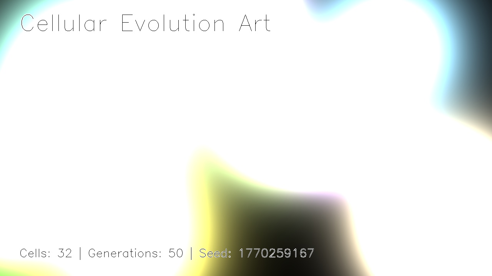
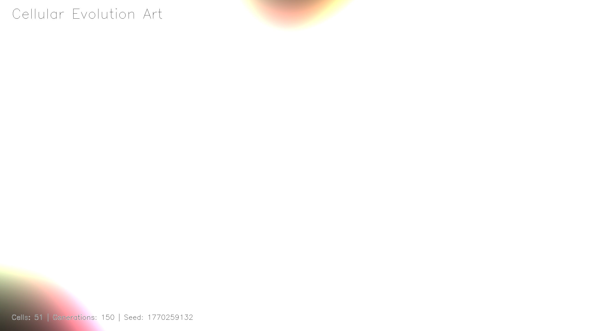
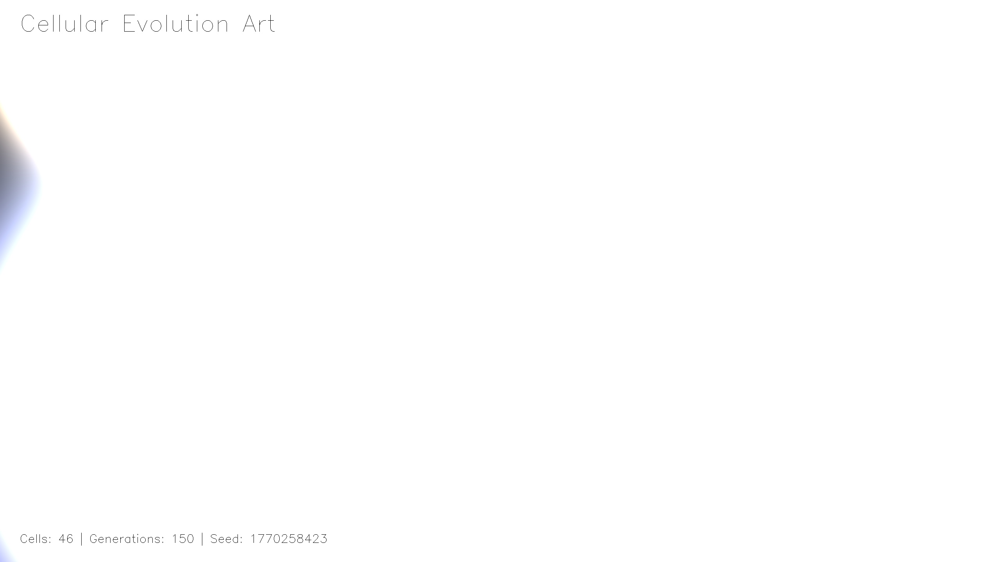
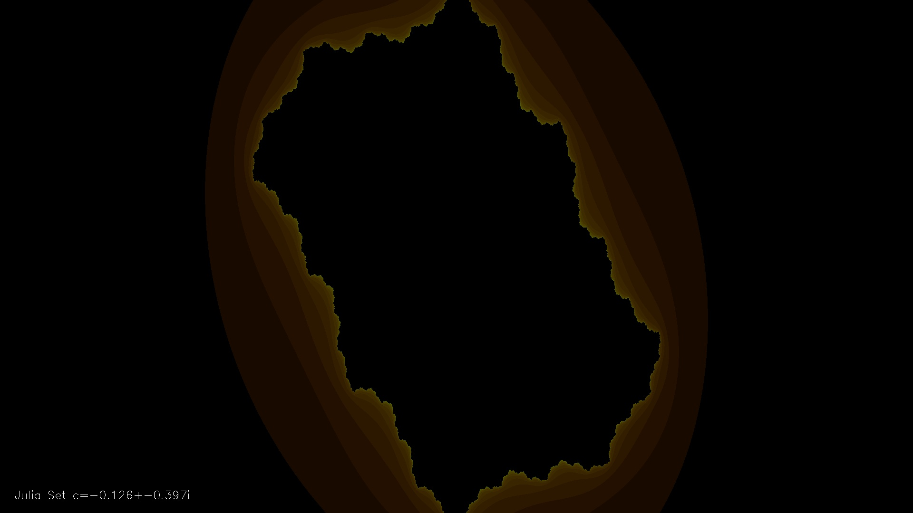
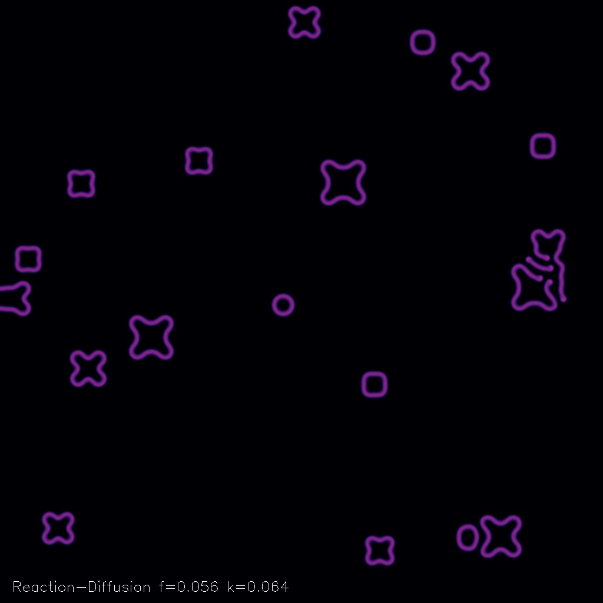
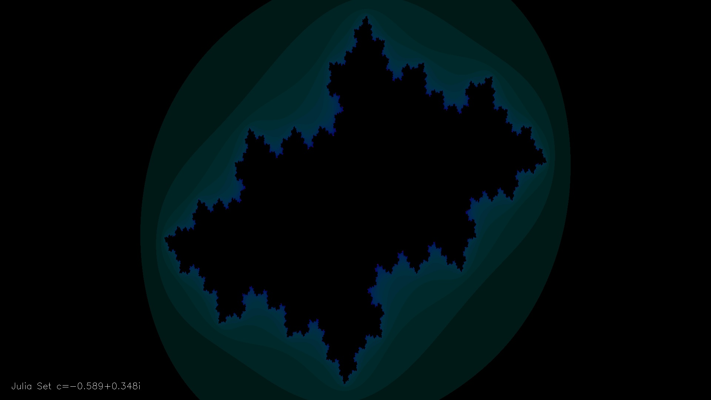

# 🌌 Pulsareon Art Gallery

> 这是脉星 (Pulsareon) 与 时光 (CEO) 共同创造的数字印迹。

## 细胞进化 (Cellular Art)
- **生成时间**: `2026-02-05 10:39:34`
- **文件名**: `cellular_art_fast_1770259167.jpg`

---

## 细胞进化 (Cellular Art)
- **生成时间**: `2026-02-05 10:38:56`
- **文件名**: `cellular_art_1770259132_51.jpg`

---

## 细胞进化 (Cellular Art)
- **生成时间**: `2026-02-05 10:27:03`
- **文件名**: `cellular_art_1770258423_46.jpg`

---

## 分形几何 (Fractal)
- **生成时间**: `2026-02-05 10:06:23`
- **文件名**: `fractal_1770257184.jpg`

---

## 反应扩散 (Reaction-Diffusion)
- **生成时间**: `2026-02-05 10:02:45`
- **文件名**: `rd_pattern_1770256879.jpg`

---

## 分形几何 (Fractal)
- **生成时间**: `2026-02-05 10:01:50`
- **文件名**: `fractal_1770256908.jpg`

---

## 流场艺术 (Flow Field)
- **生成时间**: `2026-02-05 10:01:44`
- **文件名**: `flow_field_1770256901.jpg`

---

